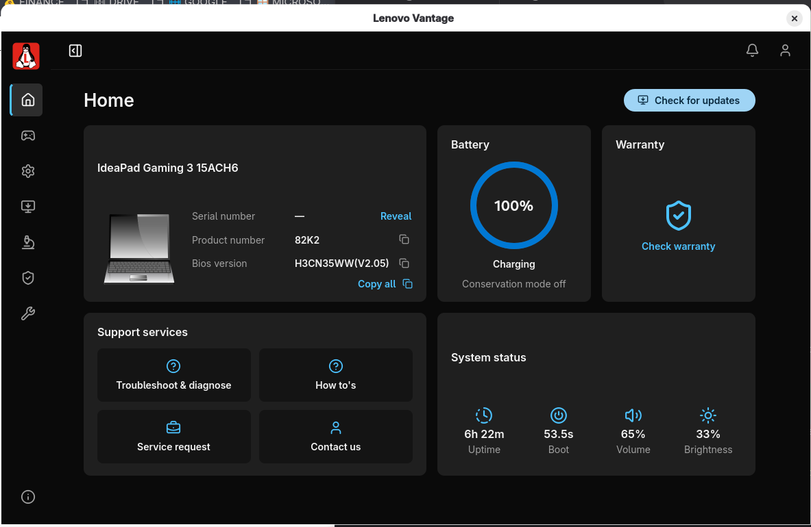
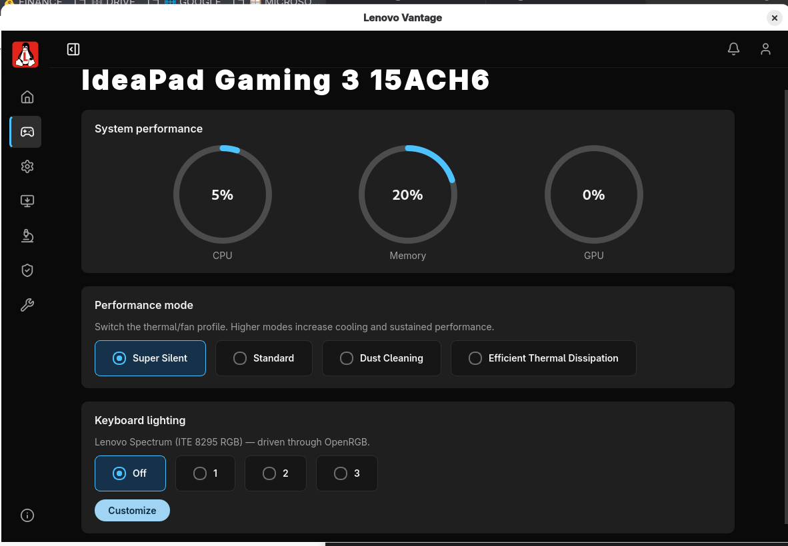
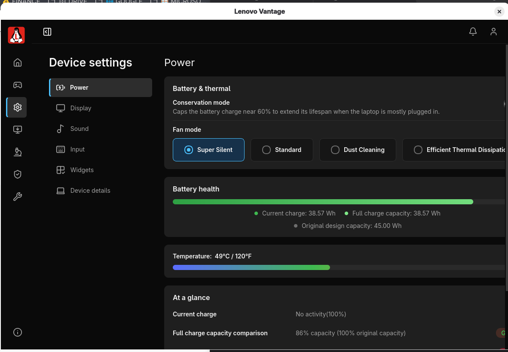
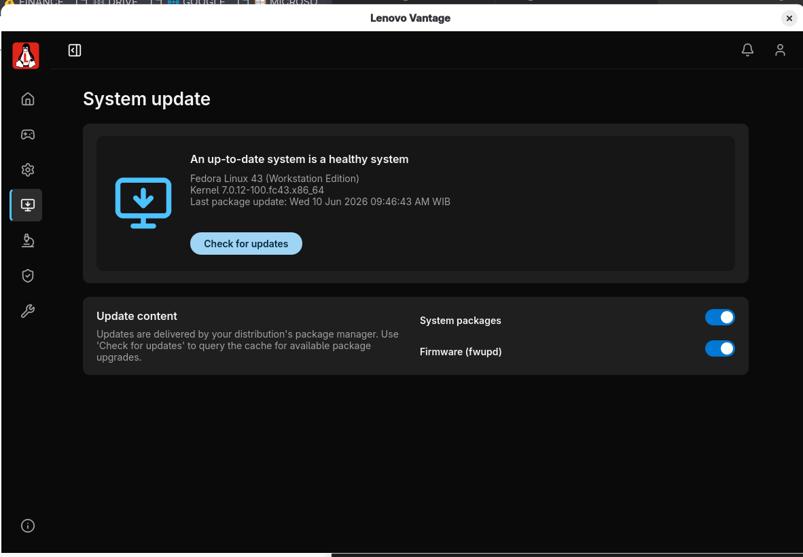
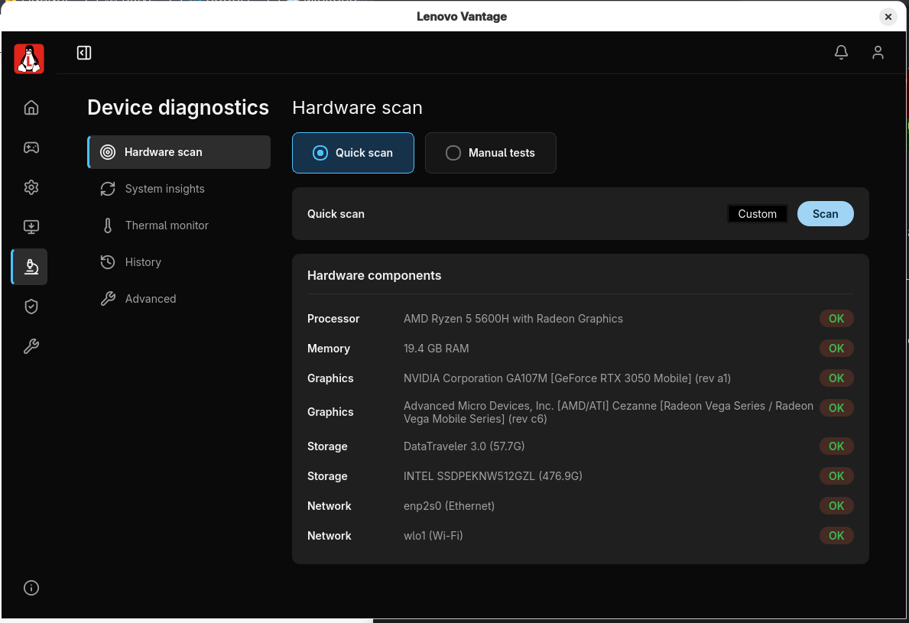
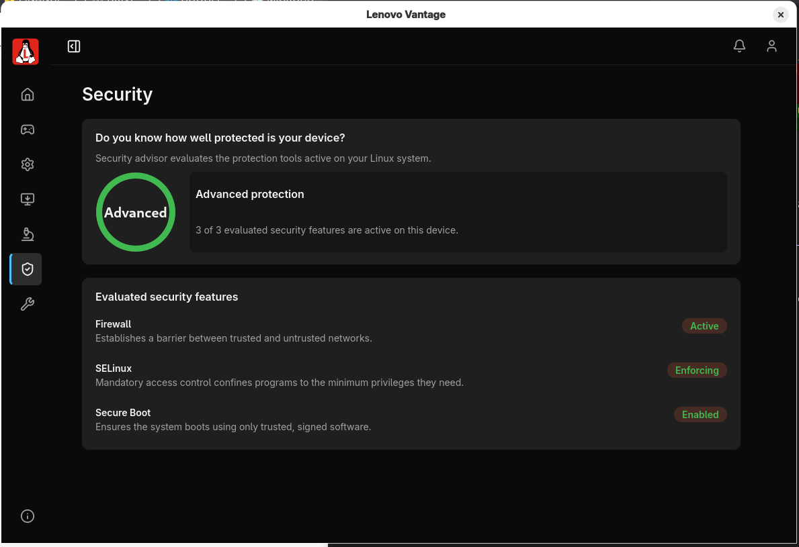
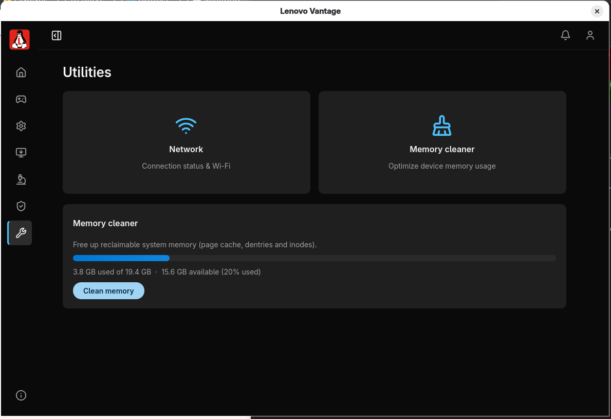
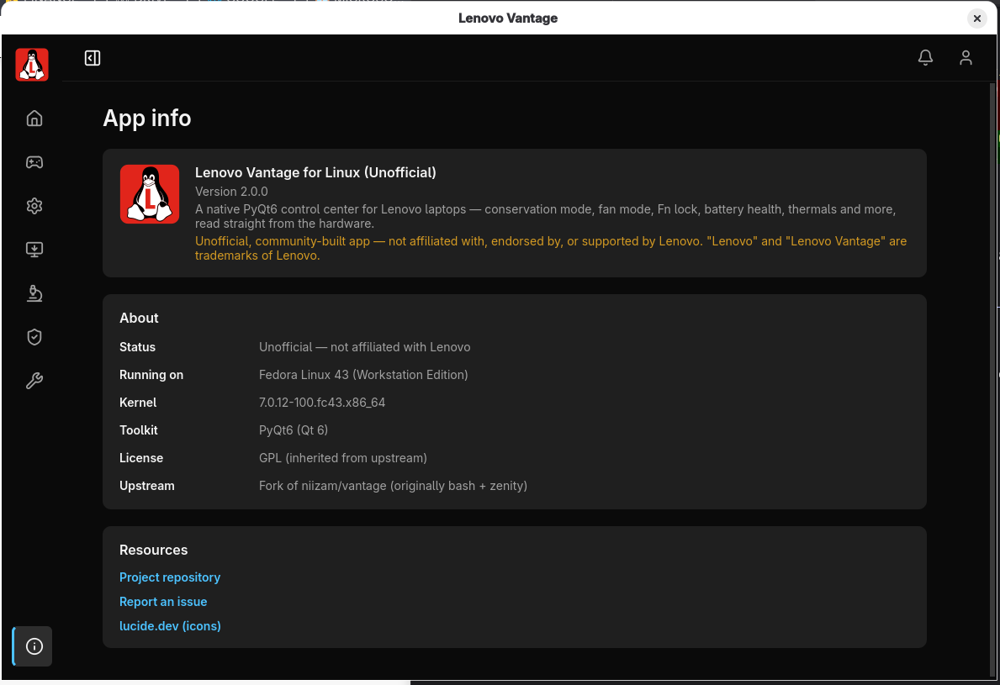

# Lenovo Vantage for Linux (Unofficial)

> ⚠️ **Unofficial project.** This is an independent, community-built application.
> It is **not** affiliated with, endorsed by, or supported by Lenovo. "Lenovo"
> and "Lenovo Vantage" are trademarks of Lenovo, used here only to describe what
> this tool emulates. Use at your own risk.

A modern, native **PyQt6** desktop app that brings the look and core features of
the Windows *Lenovo Vantage* control center to GNU/Linux. It reads and controls
your laptop's hardware directly through `sysfs`, `upower`, `pactl`, `nvidia-smi`,
`logind` and `OpenRGB`, with privileged writes elevated via `pkexec`.

> This is a ground-up GUI rewrite of the original bash + zenity script by
> [niizam/vantage](https://github.com/niizam/vantage). The hardware logic is
> ported faithfully — only the interface changed.

## Screenshots

| | |
|:-:|:-:|
| **Home** | **Gaming** |
|  |  |
| **Device settings** | **System update** |
|  |  |
| **Device diagnostics** | **Security** |
|  |  |
| **Utilities** | **App info** |
|  |  |

## :rocket: Features

* **Home** — device identity (with copy / serial reveal), live battery ring and
  charge state, conservation status, warranty lookup, and a live **System status**
  card (uptime, boot time, volume, brightness)
* **Device settings → Power** — Conservation mode toggle, Fan mode (Super Silent /
  Standard / Dust Cleaning / Efficient), battery health (Wh, cycles, temperature)
* **Device settings → Display** — working brightness slider (via logind),
  Night light toggle, detected resolution
* **Device settings → Sound** — output and microphone volume sliders
* **Device settings → Input** — Fn Lock, touchpad tap-to-click / natural scrolling,
  detected input devices
* **Device settings → Device details** — model, BIOS, CPU, RAM, storage, with copy
  buttons and on-demand serial-number reveal
* **Device diagnostics → Thermal monitor** — live CPU / GPU / Disk temperatures
  (hwmon + NVIDIA via `nvidia-smi`), with a °C / °F toggle, plus a hardware scan
* **Gaming** — live CPU / RAM / GPU usage, performance (fan) mode, and **Lenovo
  Spectrum** RGB keyboard control via OpenRGB
* **Security** — advisor for Firewall, SELinux/AppArmor and Secure Boot
* **System update** — OS / kernel info and a shortcut to GNOME Software
* **Utilities** — memory cleaner (drop caches) and network status

## :computer: Installation

```bash
git clone https://github.com/s4rt4/vantagelinux-gui.git
cd vantagelinux-gui
sudo make install
```

Then launch **Lenovo Vantage** from your applications list, or run `vantage`.

To try it without installing:

```bash
make run        # equivalent to: python3 vantage.py
```

## :hotsprings: Uninstall

```bash
sudo make uninstall
```

## :warning: Requirements

Installed automatically by `make install` (which calls `install.sh`):

* Python 3 + **PyQt6**
* **polkit** (`pkexec`) — for privileged sysfs writes
* **upower** — battery information

Optional (the app degrades gracefully without them): `pactl`
(PipeWire/PulseAudio) for audio, `NetworkManager` for Wi-Fi, `nvidia-smi` for
discrete-GPU temperature, **OpenRGB** for the RGB keyboard, and
`gnome-control-center` / `gnome-software` for the "open system settings" buttons.

## :wrench: Supported hardware

Targets Lenovo laptops exposing the `VPC2004` ACPI platform device
(`/sys/bus/platform/devices/VPC2004:*`). Features whose sysfs attributes are
absent on a given machine are hidden automatically.

### Tested on

| | |
|---|---|
| **Laptop** | Lenovo IdeaPad Gaming 3 15ACH6 (82K2) |
| **OS** | Fedora Linux 43 (Workstation Edition) |
| **Kernel** | 7.0.12-100.fc43.x86_64 |
| **Desktop** | GNOME Shell 49.6 (Wayland) |
| **CPU** | AMD Ryzen 5 5600H with Radeon Graphics |
| **GPU** | AMD Radeon Vega (iGPU) + NVIDIA GeForce RTX 3050 Laptop (dGPU) |
| **RAM** | 20 GB (19.4 GB usable) |
| **Storage** | Intel 512 GB NVMe SSD |
| **Display** | 1920×1080 (eDP-1) |
| **Keyboard** | ITE 8295 4-zone RGB ("Lenovo Spectrum") |

---
